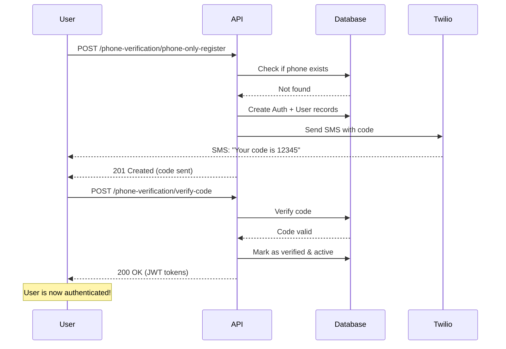
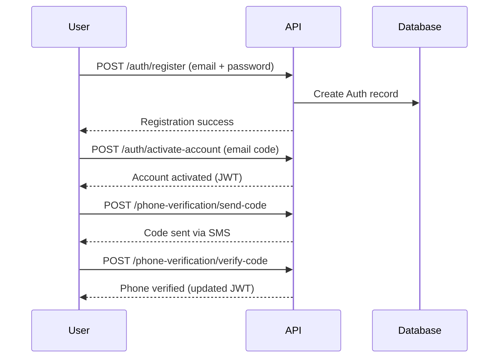

# Phone Verification API Documentation

## Overview

The Phone Verification system allows users to register and verify their phone numbers without requiring email or password. This is ideal for users who want to quickly send service requests.

**Base URL**: `/api/phone-verification`

---

## Endpoints

### 1. Phone-Only Registration

Register a new user with just a phone number (for service requests).

**Endpoint**: `POST /phone-verification/phone-only-register`

**Request Body**:
```json
{
  "phoneNumber": "+1234567890"
}
```

**Success Response** (201 Created):
```json
{
  "success": true,
  "message": "Registration successful. Please verify your phone number.",
  "data": {
    "message": "Verification code sent successfully",
    "phoneNumber": "+1234567890",
    "expiresIn": "10 minutes"
  }
}
```

**Error Responses**:
- `400 Bad Request`: Invalid phone number format
- `409 Conflict`: Phone number already registered and verified
- `500 Internal Server Error`: Failed to send SMS

**Notes**:
- Phone number must be in E.164 format (e.g., `+1234567890`)
- Creates minimal Auth and User records automatically
- Sends verification code via SMS
- If phone already exists but unverified, resends code

---

### 2. Send Verification Code

Send a verification code to an existing phone number.

**Endpoint**: `POST /phone-verification/send-code`

**Request Body**:
```json
{
  "phoneNumber": "+1234567890",
  "userType": "USER",
  "createAccount": false
}
```

**Parameters**:
- `phoneNumber` (required): Phone number in E.164 format
- `userType` (optional): "USER" or "PROVIDER" (default: "USER")
- `createAccount` (optional): Create account if doesn't exist (default: false)

**Success Response** (200 OK):
```json
{
  "success": true,
  "message": "Verification code sent successfully",
  "data": {
    "message": "Verification code sent successfully",
    "phoneNumber": "+1234567890",
    "expiresIn": "10 minutes"
  }
}
```

**Error Responses**:
- `400 Bad Request`: Invalid phone number or userType
- `404 Not Found`: Account not found (when createAccount is false)
- `429 Too Many Requests`: Rate limit exceeded (max 3 requests per hour)
- `500 Internal Server Error`: Failed to send SMS

---

### 3. Verify Phone Code

Verify the phone number with the received code and get JWT tokens.

**Endpoint**: `POST /phone-verification/verify-code`

**Request Body**:
```json
{
  "phoneNumber": "+1234567890",
  "code": "12345"
}
```

**Success Response** (200 OK):
```json
{
  "success": true,
  "message": "Phone number verified successfully",
  "data": {
    "message": "Phone number verified successfully",
    "phoneNumber": "+1234567890",
    "auth": {
      "_id": "auth_id_here",
      "role": "USER",
      "name": "User 7890",
      "email": "1234567890@phone.temp",
      "phoneNumber": "+1234567890",
      "isPhoneVerified": true
    },
    "accessToken": "eyJhbGciOiJIUzI1NiIs...",
    "refreshToken": "eyJhbGciOiJIUzI1NiIs..."
  }
}
```

**Notes**:
- Sets `refreshToken` in HTTP-only cookie
- Returns JWT access token for authenticated requests
- Activates the account (`isActive: true`, `isVerified: true`)

**Error Responses**:
- `400 Bad Request`: Invalid phone number, invalid code, or expired code
- `404 Not Found`: Phone number not found

---

### 4. Resend Verification Code

Resend the verification code to a phone number.

**Endpoint**: `POST /phone-verification/resend-code`

**Request Body**:
```json
{
  "phoneNumber": "+1234567890"
}
```

**Success Response** (200 OK):
```json
{
  "success": true,
  "message": "Verification code resent successfully",
  "data": {
    "message": "Verification code sent successfully",
    "phoneNumber": "+1234567890",
    "expiresIn": "10 minutes"
  }
}
```

**Error Responses**:
- `400 Bad Request`: Phone already verified
- `404 Not Found`: Phone number not found
- `429 Too Many Requests`: Rate limit exceeded

---

## Complete User Flow

### Flow 1: Phone-Only Registration (Recommended for Service Requests)



### Flow 2: Manual Registration & Verification



---

## Phone Number Format (E.164)

All phone numbers must use the **E.164 international format**:

**Format**: `+[country code][number]`

**Examples**:
- USA: `+11234567890`
- UK: `+442071234567`
- Bangladesh: `+8801712345678`
- India: `+919876543210`

**Invalid Examples**:
- ❌ `1234567890` (missing country code)
- ❌ `001234567890` (invalid prefix)
- ❌ `+1 (123) 456-7890` (contains special characters)
- ❌ `+1-123-456-7890` (contains dashes)

---

## Rate Limiting

To prevent abuse, the following rate limits are enforced:

- **Maximum 3 verification code requests** per phone number per hour
- Codes expire after **10 minutes**
- Rate limit resets 1 hour after the first request

**Example Error** (429 Too Many Requests):
```json
{
  "success": false,
  "message": "Too many verification requests. Please try again later."
}
```

---

## Security Features

1. **Code Expiration**: All verification codes expire after 10 minutes
2. **Rate Limiting**: Maximum 3 requests per hour per phone number
3. **E.164 Validation**: Strict phone number format validation
4. **JWT Authentication**: Secure token-based authentication after verification
5. **HTTP-Only Cookies**: Refresh tokens stored in secure cookies
6. **Role Separation**: USER and PROVIDER roles are strictly separated

---

## Testing Examples

### Using cURL

**1. Phone-Only Registration**
```bash
curl -X POST http://localhost:3000/api/phone-verification/phone-only-register \
  -H "Content-Type: application/json" \
  -d '{"phoneNumber": "+1234567890"}'
```

**2. Verify Code**
```bash
curl -X POST http://localhost:3000/api/phone-verification/verify-code \
  -H "Content-Type: application/json" \
  -d '{"phoneNumber": "+1234567890", "code": "12345"}'
```

**3. Resend Code**
```bash
curl -X POST http://localhost:3000/api/phone-verification/resend-code \
  -H "Content-Type: application/json" \
  -d '{"phoneNumber": "+1234567890"}'
```

### Using Postman

1. Import the following collection or create requests manually:
   - Method: POST
   - URL: `http://localhost:3000/api/phone-verification/phone-only-register`
   - Body (JSON):
     ```json
     {
       "phoneNumber": "+1234567890"
     }
     ```

2. Check SMS for verification code

3. Verify code:
   - Method: POST
   - URL: `http://localhost:3000/api/phone-verification/verify-code`
   - Body (JSON):
     ```json
     {
       "phoneNumber": "+1234567890",
       "code": "12345"
     }
     ```

4. Copy `accessToken` from response and use for authenticated requests:
   - Header: `Authorization: Bearer <accessToken>`

---

## Integration with Service Requests

After phone verification, users can send service requests:

```javascript
// 1. Register & Verify Phone
const registerResponse = await fetch('/api/phone-verification/phone-only-register', {
  method: 'POST',
  headers: { 'Content-Type': 'application/json' },
  body: JSON.stringify({ phoneNumber: '+1234567890' })
});

// 2. User receives SMS and enters code
const verifyResponse = await fetch('/api/phone-verification/verify-code', {
  method: 'POST',
  headers: { 'Content-Type': 'application/json' },
  body: JSON.stringify({ 
    phoneNumber: '+1234567890',
    code: '12345'
  })
});

const { accessToken } = await verifyResponse.json();

// 3. Send Service Request (authenticated)
const serviceResponse = await fetch('/api/service-requests', {
  method: 'POST',
  headers: {
    'Content-Type': 'application/json',
    'Authorization': `Bearer ${accessToken}`
  },
  body: JSON.stringify({
    categoryId: 'category_id_here',
    description: 'I need help with...',
    // ... other fields
  })
});
```

---

## Environment Variables

Required environment variables in `.env`:

```env
# Twilio Configuration
TWILIO_ACCOUNT_SID=ACxxxxxxxxxxxxxxxxxxxxxxxxxxxxxxxx
TWILIO_AUTH_TOKEN=your_auth_token_here
TWILIO_PHONE_NUMBER=+15551234567

# JWT Configuration (should already exist)
JWT_SECRET=your_jwt_secret
JWT_EXPIRE_IN=24h
JWT_REFRESH_SECRET=your_refresh_secret
JWT_REFRESH_EXPIRE_IN=30d
```

---

## Error Codes Reference

| Code | Message | Description |
|------|---------|-------------|
| 400 | Invalid phone number format | Phone number not in E.164 format |
| 400 | Invalid userType | userType must be USER or PROVIDER |
| 400 | Invalid verification code | Code doesn't match |
| 400 | Verification code has expired | Code older than 10 minutes |
| 400 | No verification code found | Need to request code first |
| 400 | Phone number is already verified | Cannot resend to verified phone |
| 404 | Phone number not found | No account with this phone |
| 404 | Account not found | Need to register first |
| 409 | Already registered and verified | Phone already in use |
| 429 | Too many requests | Rate limit exceeded (3/hour) |
| 500 | Failed to send SMS | Twilio error or configuration issue |

---

## FAQ

**Q: What happens to the temporary email?**  
A: Phone-only users get a temporary email (`{phoneNumber}@phone.temp`). They can update it later in their profile.

**Q: Can I use the same phone for USER and PROVIDER?**  
A: No, each phone can only be registered for one role.

**Q: What if I don't receive the SMS?**  
A: Use the `/resend-code` endpoint to request a new code. Check that:
- Your phone number is in E.164 format
- Your Twilio account has credits
- The phone number is not blocked

**Q: How long is the JWT token valid?**  
A: Access tokens are valid for 24 hours, refresh tokens for 30 days (configurable in `.env`).

**Q: Can I change my phone number later?**  
A: Yes, you'll need to implement a phone number update endpoint that requires verification of the new number.
